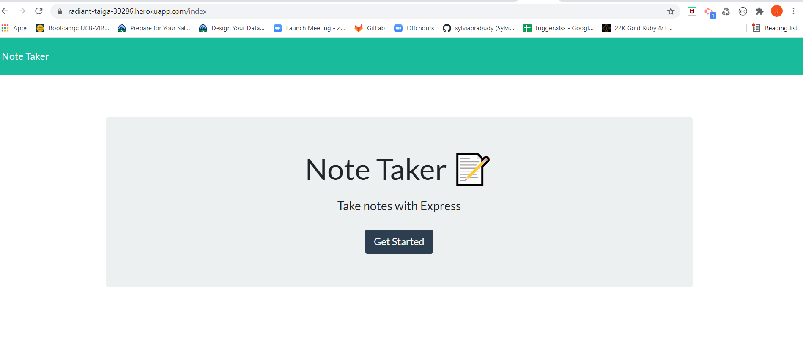
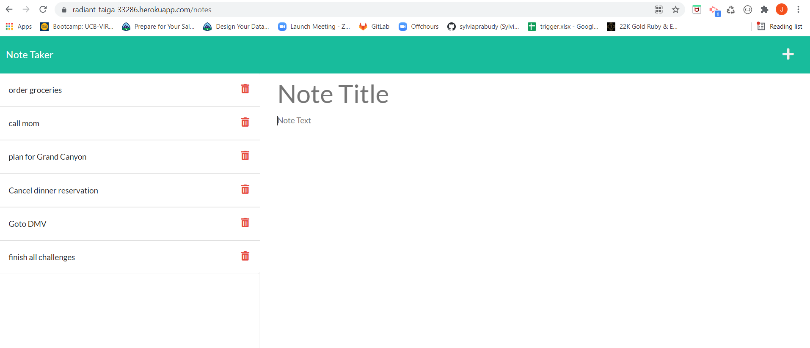

# 11 Express.js: Note Taker

* Github Repo: https://github.com/jaya1983/note-taker
* Deployed application: https://radiant-taiga-33286.herokuapp.com/notes

## Description

An application to write and save note with Express.js back end and will save and retrieve note data from JSON file.
## User Story

```
AS A small business owner
I WANT to be able to write and save notes
SO THAT I can organize my thoughts and keep track of tasks I need to complete
```


## Screensots




## Technologies Used

* Node.js

* NPM

* Express.js

* Inquirer.js

* uuid

## Contributor
Jaya Gudipalli ©2021 All Rights Reserved.
